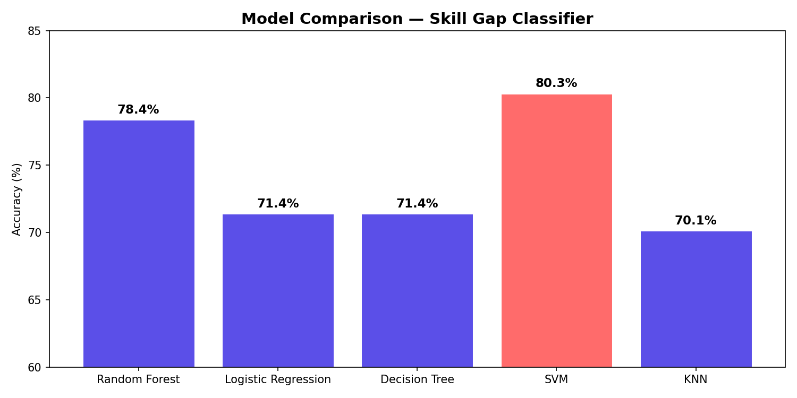

# SkillRadar — Skill Gap Intelligence System

🚀 **Live Demo**: https://skill-gap-detector-gp3o.onrender.com

> AI + ML powered placement readiness analyzer for students


---

## What is this?

SkillRadar helps students preparing for placements understand exactly where they stand. Enter your skills or upload your resume — the system compares you against real job market data and tells you what you have, what you're missing, and how to fix it.

---

## Features

- **Skill Gap Analysis** — Matched, missing, and partial skill detection against 10 tech roles
- **Readiness Score** — Weighted score (0–100%) with label (Job Ready / Almost There / Needs Work / Early Stage)
- **ML Role Prediction** — Random Forest model trained on 3,579 real LinkedIn job postings
- **Resume Upload** — PDF/TXT upload with AI-powered skill extraction via Google Gemini
- **Learning Roadmap** — Personalized links to real platforms (Coursera, LeetCode, etc.) with time estimates
- **AI Recommendations** — Gemini-generated personalized advice based on your specific gap
- **Role Comparison** — Compare your profile across all 10 job roles at once
- **Interactive Dashboard** — Radar chart + Donut chart visualizations

---

## Tech Stack

| Layer | Technology |
|-------|-----------|
| Backend | Python, Flask |
| ML Model | Scikit-learn (Random Forest + TF-IDF) |
| AI | Google Gemini 2.0 Flash |
| Frontend | HTML5, CSS3, Vanilla JS |
| Charts | Chart.js |
| PDF Parsing | PyPDF2 |
| Training Data | LinkedIn Job Postings Dataset (3.3M rows) |

---
## ML Model

- **Dataset**: LinkedIn Job Postings (Kaggle) — 3.3M job postings
- **Tech jobs extracted**: 3,579 unique postings across 11 roles
- **Features**: TF-IDF on job descriptions (500 features, bigrams)
- **Model**: Random Forest (200 trees, balanced class weights)
- **Accuracy**: 78.35% on held-out test set
- **Best performing roles**: Data Analyst (92%), Data Engineer (87%), DevOps (83%)

### Model Comparison

Five classification models were evaluated on the same dataset:

| Model | Accuracy |
|-------|----------|
| **SVM** | **80.31%** |
| **Random Forest** | **78.35%** ← selected |
| Logistic Regression | 71.37% |
| Decision Tree | 71.37% |
| KNN | 70.11% |



> Although SVM achieved the highest accuracy (80.31%), **Random Forest was selected for deployment** due to its faster inference time, native probability estimation via `predict_proba()` which powers the confidence scores in the dashboard, and better interpretability through feature importance. The 2% accuracy difference does not justify the computational overhead of SVM in a real-time web application.

---

## Supported Job Roles

1. Software Development Engineer
2. Data Scientist
3. Data Analyst
4. Machine Learning Engineer
5. Frontend Developer
6. Backend Developer
7. DevOps Engineer
8. Quantitative Analyst
9. Product Manager
10. Cybersecurity Analyst

---

## Project Structure

```
skill-gap-detector/
├── app.py                  # Flask backend (API routes)
├── analyzer.py             # Rule-based gap analysis engine
├── ml_predictor.py         # ML model integration
├── requirements.txt
├── skill_gap_model.pkl     # Trained Random Forest model
├── tfidf_vectorizer.pkl    # Fitted TF-IDF vectorizer
├── data/
│   └── job_roles.py        # Job roles skill database + learning resources
├── templates/
│   └── index.html          # Frontend dashboard
└── uploads/                # Temp resume uploads
```

---

## Setup & Run

### 1. Clone the repo
```bash
git clone https://github.com/SpoorthySM/skill-gap-detector.git
cd skill-gap-detector
```

### 2. Create virtual environment
```bash
python3 -m venv venv
source venv/bin/activate
```

### 3. Install dependencies
```bash
pip install -r requirements.txt
```

### 4. Add your Gemini API key
Create a `.env` file:
```
GEMINI_API_KEY=your_key_here
```
Get a free key at: https://aistudio.google.com

### 5. Run
```bash
python3 app.py
```
Open: **http://localhost:5000**

---

## API Endpoints

| Method | Endpoint | Description |
|--------|----------|-------------|
| GET | `/api/roles` | Get all available job roles |
| POST | `/api/analyze` | Analyze student skills vs job role |
| POST | `/api/upload-resume` | Upload resume, extract skills via AI |
| POST | `/api/compare-roles` | Compare skills across all roles |

---

## How Scoring Works

- Each required skill → **Matched** (1pt), **Partial** (0.5pt), or **Missing** (0pt)
- `Readiness Score = (matched + partial×0.5) / total_required × 100`
- Technical skills scored separately as **Tech Score**
- Labels: ≥80% = Job Ready · ≥60% = Almost There · ≥40% = Needs Work · <40% = Early Stage

---

## ML Training Notebook

The Jupyter notebook used to train the model is included separately. It covers:
- Data loading and exploration (LinkedIn dataset)
- Tech job filtering and categorization
- Feature engineering (TF-IDF on job descriptions)
- Model training (Random Forest)
- Evaluation (accuracy, classification report, confusion matrix)

---

## Built By

**Spoorthy** — B.Tech CSE (Data Science Minor), 3rd Year  
Built as a placement preparation tool combining rule-based NLP with ML classification.